# Cucumber for Kotlin and Android Intellij Plugin

Plugin for Intellij IDEA and Android Studio which helps writing and implementing [Cucumber](https://cucumber.io/) tests in [Kotlin](https://kotlinlang.org/).

It's built on top of Cucumber for Java Intellij plugin.

## Plugin features

##### Navigation between step in Gherkin file and its implementation in Kotlin

##### Navigation between Kotlin step implementation and step usages in Gherkin files

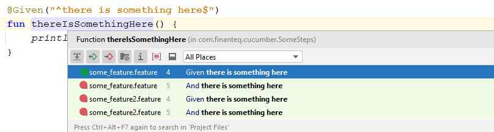

##### Presenting suggestions for typed gherkin step.

Existing matching steps are picked from all steps (implemented and not yet implemented while Cucumber for Java plugin suggests only implemented steps)

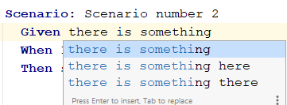

##### Creating Kotlin step implementation

Either from Quick Fix action (for not implemented step only)

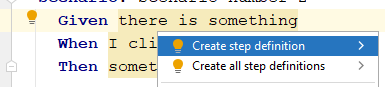

or from always available Intention Action (for any step)

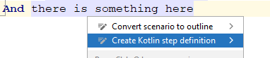

Step can be added to existing Kotlin class (which already has some step inside) or to newly created file

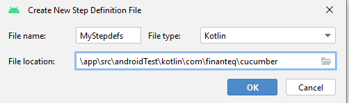

##### Creating Kotlin data class representing Gherkin data table

For normal, horizontal table just invoke intent actions in the table headers row line

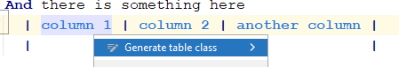

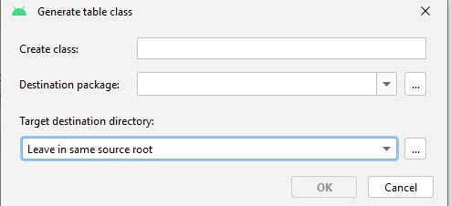

For vertical/transposed table:

- select column which contains header names
- invoke intent actions on this selection

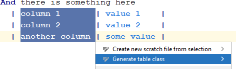

##### Running specific example from `Scenario Outline`

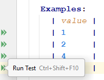

## Android specific features

##### Running scenario or example as Android Instrumented Test directly from Gherkin file

This requires using [cucumber-android](https://github.com/cucumber/cucumber-android) as `androidTest***` dependency

Run single scenario

Run single Scenario Outline example

Run entire Feature

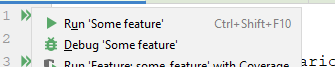

Run all features in particular folder

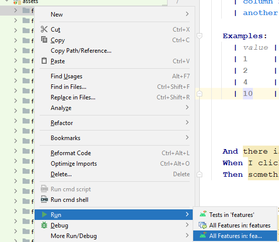

## Troubleshooting

1. Sometimes when you try to run Scenario on Android it picks wrong Run configuration type which is Cucumber Java. Then test fails because it tries to run it using Cucumber Java CLI. Configuration type should be Android Instrumented Tests. If this happens do the following:

- check icon of configuration, if there is  it means that it's wrong one
- it should look like this  (with green Android robot)
- remove wrongly created configuration
- refresh Gradle project
- run scenario again, it should detect that this is Android project and pick proper configuration type

## Building plugin

Right now this plugin is not published in JetBrains Marketplace so to use it you have to build it manually by invoking gradle task `buildPlugin`. It will build zip in `build/distributions` folder which can be installed in Intellij/Android Studio using "Install plugin from disk" option